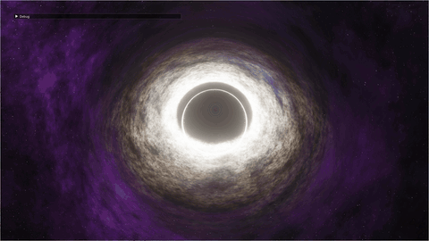

# Blackhole (Real-time Rendering)

**English Version** | [简体中文版](README.md)

This project is a real-time black hole rendering demonstration based on OpenGL.

## Visual Showcase

| Original Demo | Current Zig Build Demo |
| :---: | :---: |
|  |  |

> **Disclaimer:** This project is a fork of the open-source GitHub project [rossning92/Blackhole](https://github.com/rossning92/Blackhole). A huge thanks to the original author, Ross Ning, for the wonderful concepts and core shader code!

This project was originally built using C++, CMake, and the Conan package manager. To greatly simplify the environment setup process and provide a smooth cross-compilation experience, the entire project system has been **fully migrated to the Zig Build System**. You no longer need to install complex C++ build environments or Conan; just install a Zig compiler, and it works out of the box!

## Migration Roadmap

To elegantly transition this C++ project to a Zig project, we have planned and are executing the following four migration phases:

- [x] **Phase 1: Replace Build System with Zig**
  - [x] Remove `CMakeLists.txt` and Conan dependencies.
  - [x] Write `build.zig` and `build.zig.zon` to pass C++ sources directly to the Zig compiler.
  - [x] Configure paths for C dependencies to be managed and compiled by Zig.
  - [x] Verify that the cross-compiled C++ version renders and runs perfectly.
- [ ] **Phase 2: Partial Module Reuse and Rewrite**
  - [ ] Rewrite low-level C-library wrapper files (like `texture.cpp`) into independent `.zig` files.
  - [ ] Extract and rewrite the Shader reading and compilation pipeline (`shader.cpp`) using Zig.
  - [ ] Refactor the `Struct` data encapsulation in `render.cpp` using Data-Oriented Design.
  - [ ] Link the completed `.zig` modules back into the remaining C++ code via C ABI.
- [ ] **Phase 3: Main Logic and GUI Adaptation**
  - [ ] Remove the heavy C++ `imgui_impl_glfw` bindings.
  - [ ] Integrate a native Zig UI library (like `zgui`) to take over the Debug panel.
  - [ ] Replace the original C++ `glm` library with a more efficient and idiomatically pure `zmath`.
  - [ ] Relocate and rewrite the main OpenGL render loop logic from `main.cpp` to `main.zig`.
- [ ] **Phase 4: Introduce Zig's Safety Features**
  - [ ] Abandon default implicit garbage collection, universally use `std.heap.GeneralPurposeAllocator`.
  - [ ] Leverage the allocator to catch missing `glDelete` calls (VRAM pointer leaks) when the program terminates.
  - [ ] Apply Zig's exclusive `!void` and `catch` mechanisms to enforce error handling in the graphics pipeline.

## Environment Dependencies

- **Zig Compiler**: This project uses the Zig 0.15 build system. Please download the latest version from the [Zig official website](https://ziglang.org/).
- All third-party C++ libraries (GLFW, GLEW, GLM, Dear ImGui, stb_image) are staticized or placed in the `libs/` directory and uniformly managed by Zig's `build.zig`. **You do not need to install any C++ compilers (like MSVC or MinGW)**, Zig comes with a powerful cross-platform C/C++ compiler out of the box!

## How to Run, Debug, and Build

Open a terminal, navigate to the project root directory, and run the following commands:

### 1. Compile and Run Directly (Testing & Debugging)

The easiest way, one command to compile and run:

```bash
zig build run
```

*Note: When developing shaders or modifying code, use this command to quickly observe results. It defaults to Debug mode, which enables maximum safety checks.*

### 2. Compile and Package into an `.exe` (Release Build)

If you want to compile this project into a standalone runtime application to share with others, append the release optimization parameter (`ReleaseFast`):

```bash
zig build -Doptimize=ReleaseFast
```

This drastically improves runtime frame rate and compresses the executable size.

### 3. Where are the Build Artifacts?

After a successful build, everything you need will be located in the generated `zig-out/` folder:

- Application executable: `zig-out/bin/Blackhole.exe`
- Dynamic linked libraries (`glfw3.dll`, `glew32.dll`), shaders (`shader/`), and image assets (`assets/`) are automatically copied into the `zig-out/bin/` folder by the Zig build flow.
- You can compress **the entire `zig-out/bin/` folder** and send it to friends without a programming environment; they just double-click `Blackhole.exe` to run it!

## Debug Panel

A powerful real-time Dear ImGui debug panel is provided in the top-left corner, allowing you to modify parameters dynamically and see the rendering changes instantly (now supporting an English/Chinese toggle!):

### Core Physics Effects
- `gravatationalLensing`: Toggle **Gravitational Lensing**. The extreme gravity of the black hole bends the light from background galaxies, creating fascinating distortion artifacts.
- `renderBlackHole`: Toggle the **Black Hole entity (Event Horizon)**. Turning this off leaves only the accretion disk and background galaxies.

### Camera Controls
- `mouseControl`: Enable drag controls to rotate the viewing angle with your mouse.
- `cameraRoll`: Manually adjust the camera's roll angle (tilt to view the black hole).
- `frontView` / `topView`: Quickly switch to a "Front" or "Top" viewing angle.

### Accretion Disk Adjustments
- `adiskEnabled`: Toggle the **Accretion Disk**. This is the glowing ring of rapidly rotating, heated matter surrounding the black hole.
- `adiskParticle`: Enable particulate rendering for the accretion disk, giving the lighting a nebulous, debris-like feel.
- `adiskDensityV` / `adiskDensityH`: Adjust the matter distribution density vertically and horizontally, respectively.
- `adiskHeight`: Change the structural thickness of the accretion disk.
- `adiskLit`: The intensity of illumination/self-luminosity received from the central radiation.
- `adiskNoiseLOD` / `adiskNoiseScale`: The "noise complexity" and "scaling ratio" used to generate turbulence and perturbation features on the disk surface.
- `adiskSpeed`: The revolution and rotation speed of the fluid matter in the accretion disk.

### Post-Processing
- `bloomIterations` / `bloomStrength`: **Bloom effect**. Controls the iteration tiers of the high blur sampling, and the overall glow intensity.
- `tonemappingEnabled` / `gamma`: **Tone mapping** and Gamma correction. Ensures the brightest areas do not clip to pure white, utilizing a Gamma value (around 2.2 recommended) to correct to a realistic perceptual curve for the human eye.

## Original Author

- **Author**: Ross Ning (<rossning92@gmail.com>)
- **Original Repo**: [https://github.com/rossning92/Blackhole](https://github.com/rossning92/Blackhole)
